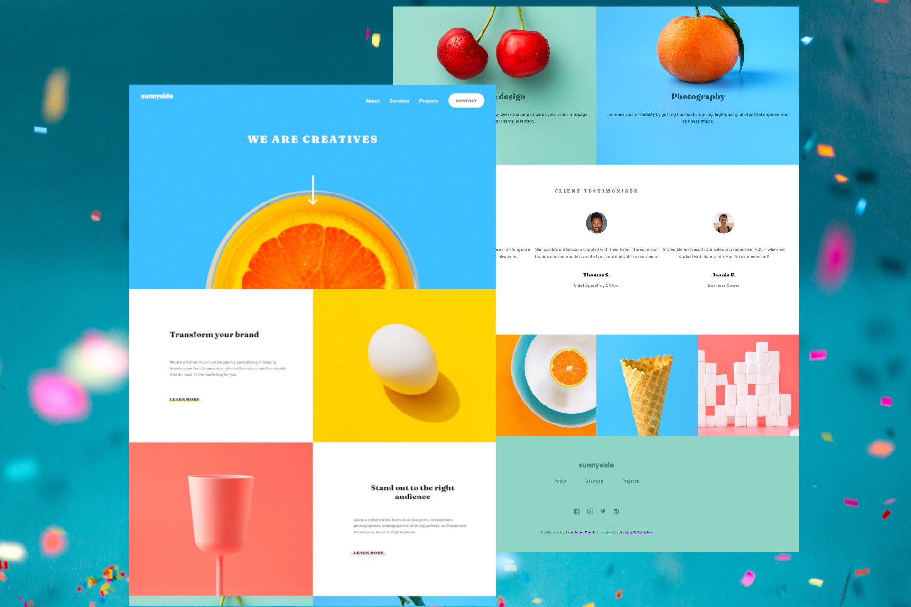

# Frontend Mentor - Sunnyside agency landing page solution

This is a solution to the [Sunnyside agency landing page challenge on Frontend Mentor](https://www.frontendmentor.io/challenges/sunnyside-agency-landing-page-7yVs3B6ef). Frontend Mentor challenges help you improve your coding skills by building realistic projects.

## Table of contents

- [Overview](#overview)
  - [The challenge](#the-challenge)
  - [Screenshot](#screenshot)
  - [Links](#links)
- [My process](#my-process)
  - [Built with](#built-with)
  - [What I learned](#what-i-learned)
  - [Continued development](#continued-development)
  - [Useful resources](#useful-resources)
- [Author](#Sasha28WebDev)

## Overview

### The challenge

Users should be able to:

- View the optimal layout for the site depending on their device's screen size
- See hover states for all interactive elements on the page

### Screenshot

### Links

- Solution URL: [github](https://github.com/Sasha28WebDev/sunnyside-agency-landing-page-main)
- Live Site URL: [github-pages]( https://sasha28webdev.github.io/sunnyside-agency-landing-page-main/)

## My process

### Built with

- Semantic HTML5 markup
- CSS custom properties
- Flexbox
- Mobile-first workflow

### What I learned

While participating in this challenge, I deepened my knowledge in html and css, for the first time laying out a page on the concept of "mobile-first" and solved a simple task of processing a button click using javascript 

### Continued development

I will use the "BEM" methodology when writing classes and try to use the preprocessor SASS.

### Useful resources

- [fls.guru/](https://fls.guru/) - I got a lot of information from this guy's blog. The explanation on working with flexbox and pseudo-elements was very helpful. 

## Author

- Frontend Mentor - [@Sasha28WebDev](https://www.frontendmentor.io/profile/Sasha28WebDev)